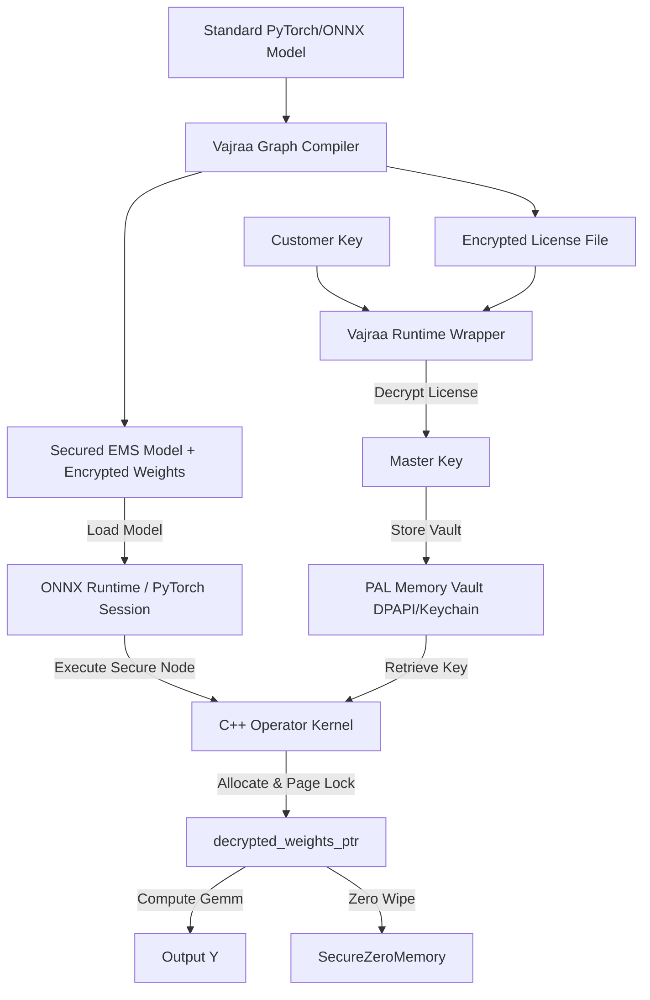

# Vajraa (वज्र) 🛡️

**Vajraa** is an indestructible, high-performance security shield for deep learning models. It provides model weights encryption, process-isolated key vaulting, and dynamic JIT execution hooks for PyTorch and ONNX Runtime to defend against reverse-engineering, weight theft, and memory dumping attacks.

---

## 🚀 Key Features

*   **Offline Graph Compiler**: Rewrites standard ONNX models into secured `.ems` graphs, encrypting static weights using hardware-accelerated AES-256-GCM.
*   **ONNX Runtime C++ Custom Operators**: Replaces standard mathematical nodes with `SecureGemm` operators. Weights are decrypted JIT and immediately zero-wiped from physical memory after kernel execution.
*   **LoRA PEFT Adapter Shield**: Secures low-rank projections (`lora_A` and `lora_B`) at rest, dynamic hook injection decrypts parameters page-locked into protected RAM only during forward execution.
*   **Platform Abstraction Layer (PAL)**: Protects JIT decryption keys in an OS-level secure storage (Windows DPAPI, macOS Keychain, Linux XOR-obfuscation) and enforces anti-debugging page-level memory isolation (`PAGE_NOACCESS`).
*   **CNG Cryptographic Engine**: Integrates natively with Windows Cryptography Next Generation (CNG) to deliver hardware-accelerated decryption without heavy external library dependencies (like OpenSSL).

---

## 📐 Architecture Overview



---

## 🛠️ Build and Setup

### Prerequisites

1.  **C++17 Compiler** (MSVC 2017+ on Windows, GCC/Clang on macOS & Linux)
2.  **CMake** 3.12+ (ensure it is accessible via terminal or specify the absolute path)
3.  **Python** 3.8+ with pip

### 1. Install Dependencies

Install required Python packages:

```bash
pip install numpy onnx onnxruntime cryptography torch peft
```

### 2. Fetch ONNX Runtime Headers

Align C++ headers with the installed ONNX Runtime version (e.g. 1.27.0):

```bash
python tools/fetch_headers.py
```

### 3. Compile the C++ Library

Configure and compile the shared library (`vajraa.dll` / `vajraa.so`):

```bash
cmake -B build -S .
cmake --build build --config Release
```

---

## 💡 Quick Start

### 1. Compile and Secure an ONNX Model

Use `onnx_compiler.py` to encrypt weights and replace standard execution nodes with secure custom operators:

```python
import os
from vajraa.onnx_compiler import rewrite_onnx_graph
from vajraa.crypto import generate_license

# Parameters
master_key = os.urandom(32)
customer_key = os.urandom(32)

# 1. Compile model representation
rewrite_onnx_graph("my_model.onnx", "secured_model.ems", master_key)

# 2. Generate license mapping for customer
lic_bytes = generate_license("customer_id_123", master_key, customer_key)
with open("model.lic", "wb") as f:
    f.write(lic_bytes)
```

### 2. Run Secure Inference with ONNX Runtime

Load the compiled model and license key into a secure inference session:

```python
import numpy as np
from vajraa.onnx_wrapper import SecureONNXSession

# Initialize secure inference session
session = SecureONNXSession(
    model_path="secured_model.ems",
    license_path="model.lic",
    customer_key=customer_key
)

# Run inference
inputs = {"input_node": np.random.randn(1, 4).astype(np.float32)}
outputs = session.run(["output_node"], inputs)
print("Result:", outputs)
```

### 3. Protect LoRA Adapters (PyTorch)

Secure adapters at rest and insert dynamic execution wrappers:

```python
import torch
from peft import LoraConfig, get_peft_model
from vajraa.lora_shield import compile_lora_weights, secure_wrap_lora

# Mock adapter module configuration
model = torch.nn.Sequential(torch.nn.Linear(10, 5))
peft_config = LoraConfig(r=8, target_modules=["0"])
peft_model = get_peft_model(model, peft_config)

# 1. Encrypt and compile the adapter weights
master_key = os.urandom(32)
encrypted_state_dict = compile_lora_weights(peft_model, master_key)

# 2. Wrap adapter layers in memory-isolated forward wrappers
secure_wrap_lora(peft_model, encrypted_state_dict, master_key)

# 3. Model executes safely; weights are only present in RAM during the forward pass
dummy_in = torch.randn(1, 10)
out = peft_model(dummy_in)
```

### 4. Protect PyTorch Base Model Weights

Secure base parameters (e.g. `nn.Linear`, `nn.Conv2d` layers) at rest and JIT-decrypt them dynamically:

```python
import torch
import torch.nn as nn
import os
from vajraa.base_shield import compile_base_weights, secure_wrap_base

# 1. Initialize your model
model = nn.Sequential(
    nn.Linear(10, 5),
    nn.ReLU(),
    nn.Linear(5, 2)
)

# 2. Encrypt and compile the base layer parameters
master_key = os.urandom(32)
compiled_weights = compile_base_weights(model, master_key)

# 3. Wrap model layers to erase weight variables and mount JIT hooks
secure_wrap_base(model, compiled_weights, master_key)

# 4. Standard execution is fully operational; memory is locked and zero-wiped JIT
dummy_in = torch.randn(1, 10)
out = model(dummy_in)
```

---

## 🧪 Running the Verification Suite

Run automated unit and integration tests to verify key vaulting, memory protection, compiler, and wrapper mechanics:

```bash
python -m unittest discover -s tests
```

---

## 🔒 Security Properties

| Defense | Mechanism | Impact |
| :--- | :--- | :--- |
| **Encrypted Initializers** | AES-256-GCM at rest and in model graphs | Prevents inspection/theft from model files on disk or asset repositories. |
| **Virtual Memory Locking** | `VirtualProtect` (Windows) / `mprotect` (Linux) | Decrypted weights reside in isolated, un-swappable physical memory pages. |
| **Zero Memory Residue** | `SecureZeroMemory` / `pal_secure_zero` | Zeroes out stack frames and virtual allocations immediately after forward pass. |
| **Isolated Key Storage** | Windows DPAPI / macOS Keychain | Key credentials are bound to process-context and user space to block cross-process extraction. |
| **Anti-Debugging** | `pal_is_debugger_attached` & timing checks | Terminates process if step-through or remote debugging signatures are detected. |
